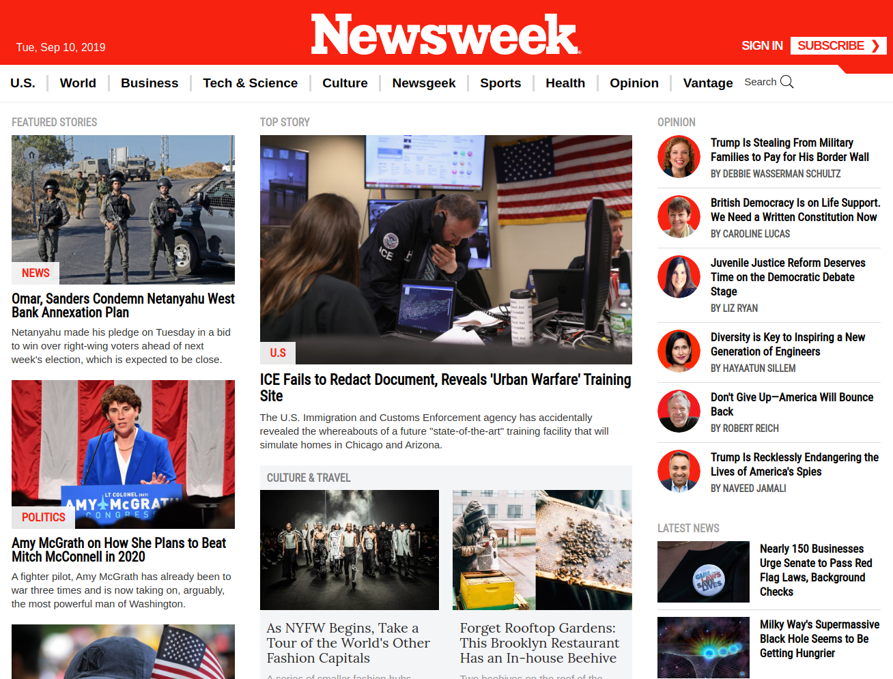

# bootstrap-newsweek-clone

This project consists of getting a chance to try out Twitter’s Bootstrap framework by building a site that actually uses it – Newsweek. You can find the original project specification [here](https://www.theodinproject.com/courses/html5-and-css3/lessons/using-bootstrap)

## Screenshot


## Live Version:

You can check the live version [here](https://jstiven01.github.io/bootstrap-newsweek-clone/)

## Source Page:

https://www.newsweek.com

## Built With:

Twitter’s Bootstrap framework, HTML5 CSS3, using Grid, Flexbox and media querys CSS

## Usage

1. Clone the project to your local directory

```
 git clone https://github.com/jstiven01/bootstrap-newsweek-clone.git
```

2. Get in to the folder app

```
cd bootstrap-newsweek-clone
`````

3. Open the next file in your favorite browser:

```
index.html
`````

## Automated Tests

This project has no automated tests. This will be an upcoming feature

## Upcoming Features

To see the upcoming features check the [issues page](https://github.com/jstiven01/bootstrap-newsweek-clone/issues)


## Author

👤 **Johan Stiven Tinjacá Tocora**

- Github: [@jstiven01](https://github.com/jstiven01)
- Email: [stiven10@gmail.com](mailto:stiven10@gmail.com)
- Twitter: [@TinjacaJohan](https://twitter.com/TinjacaJohan)
- Linkedin: [Johan Tinjacá](https://www.linkedin.com/in/johanstiventinjaca/)
